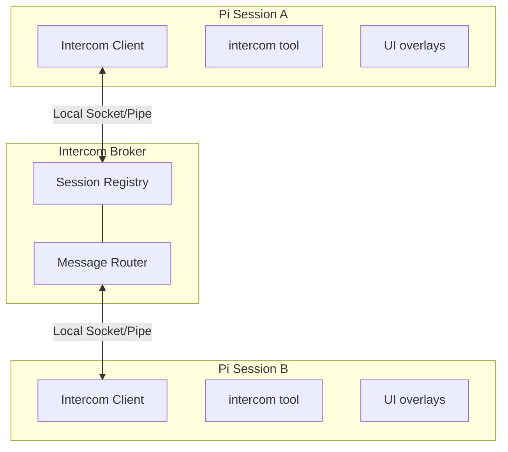

<p>
  
</p>

# Pi Intercom

Direct 1:1 messaging between pi sessions on the same machine. Send context, findings, or requests from one session to another — whether you're driving the conversation or letting agents coordinate.

```text
User flow: press Alt+M or run /intercom to pick a session and send a message
```

## Why

Sometimes you're running multiple pi sessions — one researching, one executing, one reviewing. Pi-intercom lets you:

- **User-driven orchestration** — Send context or findings from your research session to your execution session
- **Agent collaboration** — An agent can reach out to another session when it needs help or wants to share results
- **Session awareness** — See what other pi sessions are running and their current status

Unlike pi-messenger (a shared chat room for multi-agent swarms), pi-intercom is for targeted 1:1 communication where you pick the recipient.

Pi-intercom also integrates well with [pi-subagents](https://github.com/nicobailon/pi-subagents): delegated child agents get a child-only `contact_supervisor` tool when `pi-subagents` supplies bridge metadata. Use `reason: "need_decision"` for blocking clarification, `reason: "interview_request"` for multiple structured supervisor answers, and `reason: "progress_update"` for meaningful plan-changing updates. Normal sessions only see the regular `intercom` tool.

## In One Minute

Each pi session that has `pi-intercom` loaded and enabled connects to a tiny local broker over a local IPC transport. The broker keeps track of connected sessions and routes direct messages to the one you target by name or session ID. Typing `#` in the editor suggests a session's `/name`, but the `intercom` tool itself takes the plain name/ID. The extension gives you both a tool (`intercom`) and a small overlay UI (`/intercom` or `Alt+M`). Incoming messages are rendered inline inside the recipient session, can trigger a turn immediately, and are also stored in Pi session history as extension entries.

## Install

```bash
pi install npm:pi-intercom
```

Then restart Pi. The extension auto-connects to the broker on startup and registers the bundled `pi-intercom` skill for common coordination patterns.

**Recommended:** Add this snippet to your project's `AGENTS.md` to help agents understand when to coordinate across sessions:

```xml
<pi-intercom>
Coordinate with other local pi sessions on related codebases. Use `/skill:pi-intercom` for patterns.

**When:** Same codebase (parallel work), reference codebase (consulting patterns), related repos (shared libraries).

**Not when:** Unrelated codebases, trivial questions, or when you can proceed independently.

**Principle:** Prefer `send` for notifications; `ask` only when blocked waiting for input.
</pi-intercom>
```

A session becomes intercom-connected when all of these are true:
- the `pi-intercom` extension is installed and loaded in that session
- `enabled` is not set to `false` in `~/.pi/agent/intercom/config.json`
- the session has started or reloaded after the extension was installed
- the local broker is running or can be auto-started

The session list only shows intercom-connected sessions, not every open Pi process on the machine.

If a session is unnamed, pi-intercom now exposes a runtime-only fallback alias like `subagent-chat-1a2b3c4d` so other sessions can still target it. That alias is not persisted as the Pi session title, so `pi --resume` can keep showing the transcript snippet instead of a generic `session-...` name.

## Quick Start

### From the Keyboard

Press **Alt+M** or type `/intercom` to open the session list overlay:

1. **Select a session** — Use arrow keys to pick a target session
2. **Compose message** — Write your message in the compose overlay
3. **Send** — Press Enter to send, Escape to cancel

### From the Agent

The agent can list sessions and send messages using the `intercom` tool. Tool calls and results render as compact transcript rows so send/ask/reply flows are easy to scan. For common patterns like planner-worker delegation, the bundled `pi-intercom` skill provides copy-paste ready examples:

```typescript
// List sessions in the current working directory
intercom({ action: "list" })
// → **~/projects/api [current]:**
// → • executor [idle] (20d43841) (claude-sonnet-4) [self]
// → • research [working] (6332faab) (claude-sonnet-4)
// List every connected session, grouped by working directory
intercom({ action: "list", list_all: true })

// Send using the plain session name
intercom({ action: "send", to: "research", message: "Check if UserService.validate() handles null" })
// → Message sent to research

// Check connection status
intercom({ action: "status" })
// → Connected: Yes, Session ID: abc123, Active sessions: 3

// Send with attachments (code snippets, files, or context)
intercom({
  action: "send",
  to: "worker",
  message: "Here's the fix:",
  attachments: [{
    type: "snippet",
    name: "auth.ts",
    language: "typescript",
    content: "function validate(user: User) { ... }"
  }]
})
```

### Receiving Messages

When a message arrives, it appears inline in your chat with the sender's info and a reply hint:

```
**From research** (~/projects/api)

To reply, use the intercom tool: intercom({ action: "reply", message: "..." })

Found the issue — UserService.validate() doesn't check for null input.
See auth.ts:142-156.
```

The reply hint (enabled by default) points to `intercom({ action: "reply", ... })`, so recipients do not need raw sender or `replyTo` IDs. Idle recipients get a new turn immediately; busy interactive recipients receive the message once they go idle. Attachment content is included in the agent-visible body, and messages are rendered inline and stored in Pi session history.

### Inline # Targets

Typing `#` in the editor autocompletes a connected session's `/name`, so you can pick the exact target without mistyping it. `#worker` is only an input-time marker; `intercom list` output itself is unchanged.

Use `#worker` in the prompt as the selection marker; when calling the `intercom` tool, pass the plain session name without `#`:

```text
给 #worker 发消息：Task-3: add retry logic
问下 #worker 这个 API 的限流策略
```

```typescript
intercom({ action: "send", to: "worker", message: "Task-3: add retry logic" })
intercom({ action: "ask", to: "worker", message: "这个 API 的限流策略是什么？" })
```

When a known `#alias` is present, the extension appends this instruction to the user message instead of globally injecting it:

```xml
<pi_intercom> use tool `intercom` with target as "worker" </pi_intercom>
```

Messages without a known `#alias` are left untouched, so the model never sees the intercom routing hint unless the `#` feature is used.

While typing, known `#aliases` are suggested after `#`. Unknown `#tokens`, Markdown headings, slash commands, and prompts referencing multiple different aliases are left unchanged. Sessions with duplicate `/name` values keep the same alias and remain ambiguous; use the session ID from the list to disambiguate.

## CLI (Command Line)

You don't need to be inside pi to talk to a running session. The extension ships a small CLI that connects to the same local broker, so you can message or ask any running agent directly from your terminal:

```bash
pi-intercom list                          # list connected pi sessions
pi-intercom status                        # show broker/session status
pi-intercom send worker "Task-4: run the migration"   # fire-and-forget
pi-intercom ask worker "Should I use A or B?"        # ask and wait for the reply
```

`ask` sends the message with `expectsReply: true`, so the receiving agent sees the usual reply hint and can answer with `intercom({ action: "reply", message: "..." })`. The CLI blocks until the reply arrives (default 10-minute timeout, `--timeout <seconds>` to override, Ctrl+C to abort) and prints the reply on stdout:

```bash
$ pi-intercom ask planner "Retry POST requests too?"
Asking planner (a518e269)... waiting for reply (timeout 600s)
Only GET/PUT/DELETE — never POST. Max 3 retries.
```

When the message argument is empty, the message is read from stdin — piped for multi-line content, or typed interactively (finish with Ctrl+D):

```bash
echo "Should I use exponential backoff or fixed intervals?" | pi-intercom ask worker
pi-intercom ask worker   # then type the message, press Ctrl+D
```

### Install

**Global via bun** (links the live folder, so `git pull` updates the command):

```bash
cd <where pi-setup lives>/extensions/pi-intercom
bun link
```

**Symlink onto PATH** (any shell):

```bash
ln -s ~/.pi/agent/git/github.com/sjet47/pi-setup/extensions/pi-intercom/cli/pi-intercom ~/.local/bin/pi-intercom
```

The path above matches a `pi install git:github.com/sjet47/pi-setup` layout; point the symlink at wherever the extension lives in your setup. When installed via npm (`pi install npm:pi-intercom`), the `bin` entry provides the same `pi-intercom` command after the package is linked.

### Notes

- The CLI connects as an **invisible guest**: it never appears in `intercom({ action: "list" })`, other sessions are not notified when it connects, and it is only addressable by its exact session id (so replies reach it, but agents can't target it by name).
- Data goes to stdout (session list, replies); progress/status messages go to stderr, so `pi-intercom ask ... | jq`-style pipelines stay clean.
- If the broker is not running, the CLI auto-spawns it (same as pi sessions do).
- `--name <name>` sets the sender name the recipient sees (default: `cli`), e.g. `pi-intercom --name deploy-script ask worker "check the deploy"`.

## Workflow: Planner-Worker Coordination

The most natural use of pi-intercom is splitting a task between two sessions — one holds the big picture, the other does the hands-on work. When the worker hits an ambiguity ("should I optimize for readability or performance here?"), they ask without losing context.

### Setup

Open two terminals and start pi in each. Name them so they can find each other:

```
# Terminal 1                    # Terminal 2
/name planner                   /name worker
```

Verify they see each other from either session:

```typescript
intercom({ action: "list" })
// → • worker — ~/projects/api (claude-sonnet-4) [idle]
```

### The Conversation

Here's how a typical exchange looks. The planner delegates with `send` (fire-and-forget). The worker uses `ask` for anything that needs a response — questions, discoveries, completion reports. `ask` sends the message and blocks until the planner replies, so the worker gets the answer as a tool result and continues in the same turn.

**Planner sends a task:**
```typescript
intercom({
  action: "send",
  to: "worker",
  message: "Task-3: Add retry logic to API client. Key files: src/api/client.ts, src/api/types.ts. Ask if anything's unclear."
})
```

**Worker hits an ambiguity — asks and waits:**
```typescript
intercom({
  action: "ask",
  to: "planner",
  message: "Should retry apply to all endpoints or just idempotent ones? Also, max retry count and backoff strategy?"
})
// → Reply from planner: Only GET/PUT/DELETE — never POST. Max 3 retries, exponential backoff starting at 100ms.
// Worker continues implementing with the answer, same turn, full context.
```

**Worker finds something unexpected — escalates and waits:**
```typescript
intercom({
  action: "ask",
  to: "planner",
  message: "Found: fetchWithTimeout swallows network errors. Fixing this changes the error shape. OK to proceed?"
})
// → Reply from planner: Yes, surface the error types. The current behavior is a bug.
```

**Worker reports completion:**
```typescript
intercom({
  action: "ask",
  to: "planner",
  message: "Task-3 done. Added RetryPolicy type, applied to GET/PUT/DELETE, surfaced NetworkError, 4 tests passing."
})
// → Reply from planner: Looks good. Move on to task-4.
```

### Communication Patterns

| Pattern | Action | Why |
|---------|--------|-----|
| **Task Delegation** | Planner uses `send` | Fire-and-forget. Planner doesn't need to wait for an ack. |
| **Clarification Request** | Worker uses `ask` | Worker needs the answer to proceed. Blocks until reply. |
| **Discovery Escalation** | Worker uses `ask` | Worker needs approval before changing course. |
| **Completion Report** | Worker uses `ask` | Planner might have follow-up instructions or the next task. |

### Reply Hints

When `replyHint` is enabled (the default), incoming messages include the exact `intercom()` call to respond:

```
**From planner** (~/projects/api)

To reply, use the intercom tool: intercom({ action: "reply", message: "..." })

Only GET/PUT/DELETE — never POST. Max 3 retries with exponential backoff starting at 100ms.
```

This matters because the agent receiving the message doesn't need to reconstruct raw `to` and `replyTo` IDs — the hint is right there. Combined with idle-gated `triggerTurn` delivery, it enables real back-and-forth conversation without interrupting work in progress. If the reply happens later instead of in the triggered turn, `intercom({ action: "reply" })` falls back to the single unresolved inbound ask, and `intercom({ action: "pending" })` shows who is still waiting.

### `send` vs `ask`

`send` is fire-and-forget — the tool returns immediately after delivery. By default, it sends immediately even in interactive sessions. If you want an approval dialog before non-reply sends, set `confirmSend: true` in config. Replies that include `replyTo` still skip confirmation so reply-hint flows can continue without an extra approval step.

`ask` sends the message and blocks until the recipient responds (10-minute timeout). The reply comes back as the tool result, so the agent continues in the same turn with full context. No confirmation dialog — if you're asking and waiting, the intent is clear.

`reply` is receiver-side sugar for replying to an inbound ask. In the turn triggered by an incoming intercom ask, `intercom({ action: "reply", message: "..." })` targets that exact sender and message automatically. If you reply later, it falls back to the single unresolved inbound ask. If multiple asks are pending, use `intercom({ action: "pending" })` to inspect them and then call `reply` with `to` to disambiguate.

The planner typically uses `send`. If you prefer manual approval for outgoing non-reply messages, turn on `confirmSend: true`. The worker uses `ask` for everything (no confirmation needed, gets answers inline), so it can operate autonomously either way.

## Workflow: Subagent-to-Supervisor Escalation

This workflow requires [`pi-subagents`](https://github.com/nicobailon/pi-subagents) to be installed and to supply child bridge metadata. When `pi-subagents` spawns a delegated child with that metadata, the child session gets a subagent-only `contact_supervisor` tool in addition to the regular `intercom` tool. Normal sessions never see `contact_supervisor`.

### When the Tool Appears

`contact_supervisor` only registers when `pi-subagents` sets all of these environment variables:

- `PI_SUBAGENT_ORCHESTRATOR_TARGET` — the supervisor session name or ID
- `PI_SUBAGENT_RUN_ID` — the run identifier
- `PI_SUBAGENT_CHILD_AGENT` — the agent type
- `PI_SUBAGENT_CHILD_INDEX` — the child index within the run

If any are missing, the session falls back to the regular `intercom` tool.

### Three Reasons

| Reason | Behavior | Use When |
|--------|----------|----------|
| `need_decision` | Sends an ask and blocks until the supervisor replies (10-minute timeout) | The subagent is blocked, uncertain, needs approval, or faces a product/API/scope decision |
| `interview_request` | Sends structured questions and blocks until the supervisor replies | The subagent needs multiple machine-readable answers from the supervisor in one exchange |
| `progress_update` | Fire-and-forget update to the supervisor | Meaningful progress or unexpected discoveries that change the plan |

Do not use `contact_supervisor` for routine completion handoffs. Return the final subagent result normally through `pi-subagents`.

### Example: Blocked Subagent Asks for Guidance

```typescript
contact_supervisor({
  reason: "need_decision",
  message: "The auth service returns 403 instead of 401 for expired tokens. Should I treat 403 as a re-auth trigger or a hard failure?"
})
// → Reply from supervisor: Treat 403 as re-auth trigger. Update the token refresh logic.
```

### Example: Structured Supervisor Interview

```typescript
contact_supervisor({
  reason: "interview_request",
  message: "Please answer these before I continue the migration.",
  interview: {
    title: "API migration choices",
    questions: [
      { id: "api", type: "single", question: "Which API should I target?", options: ["Stable API", "Experimental API"] },
      { id: "constraints", type: "text", question: "What constraints should I preserve?" }
    ]
  }
})
// → Reply from supervisor: { "responses": [{ "id": "api", "value": "Stable API" }, ...] }
```

### Example: Progress Update

```typescript
contact_supervisor({
  reason: "progress_update",
  message: "Discovered the bug is in the retry wrapper, not the API client. Fixing the wrapper will also close issue #42."
})
// → Progress update sent to supervisor planner
```

### What the Supervisor Sees

The supervisor receives a formatted message with run metadata:

```
**From subagent-worker-78f659a3-1**

Subagent needs a supervisor decision.
Run: 78f659a3
Agent: worker
Child index: 0

Which API should I use?
```

Reply hints work the same as regular `intercom` ask/reply flows. The supervisor can reply with `intercom({ action: "reply", message: "..." })` and the subagent receives the answer as the tool result.

For `interview_request`, the supervisor message includes the structured questions plus a fenced JSON answer example using this stable shape:

```json
{
  "responses": [
    { "id": "api", "value": "Stable API" },
    { "id": "constraints", "value": "Keep the public error shape unchanged." }
  ]
}
```

The supervisor can reply with plain JSON or a fenced `json` block. If the reply matches the `{ "responses": [...] }` shape and references valid question ids/options, the child tool result includes it in `details.structuredReply` while still showing the raw reply text.

## Tool Reference

### intercom

| Parameter | Type | Description |
|-----------|------|-------------|
| `action` | string | `"list"`, `"send"`, `"ask"`, `"reply"`, `"pending"`, or `"status"` |
| `to` | string | Target session name or ID (for send/ask, or to disambiguate reply) |
| `message` | string | Message text (for send/ask/reply) |
| `attachments` | array | Optional `file`, `snippet`, or `context` attachments |
| `replyTo` | string | Optional message ID for threading or replying to an `ask` |
| `list_all` | boolean | For `list`, include every connected cwd and group results by cwd (default: `false`) |

### contact_supervisor

Only registered in sessions where `pi-subagents` supplied the required child bridge metadata. Contacts the supervisor session that delegated the current task.

| Parameter | Type | Description |
|-----------|------|-------------|
| `reason` | string | `"need_decision"` (blocking), `"interview_request"` (blocking structured questions), or `"progress_update"` (fire-and-forget) |
| `message` | string | The decision request, optional interview note, or progress update |
| `interview` | object | Required for `interview_request`: `{ title?, description?, questions: [...] }` |

**`need_decision`** — Sends a formatted ask to the supervisor and blocks until it replies (10-minute timeout). The reply comes back as the tool result. Includes run metadata in the message so the supervisor knows which subagent is asking.

**`interview_request`** — Sends a formatted, agent-readable interview to the supervisor and blocks until it replies. Questions use a local pi-interview-like shape: `{ id, type, question, options?, context? }` where `type` is `single`, `multi`, `text`, `image`, or `info`. `info` questions are context-only and do not need responses. The supervisor reply should be JSON with `{ "responses": [{ "id": "...", "value": ... }] }`. Parsed JSON replies are returned in `details.structuredReply`.

**`progress_update`** — Sends a non-blocking update to the supervisor. Returns immediately after delivery. Use only for meaningful progress or unexpected discoveries that change the plan.

### intercom actions

**`list`** — By default returns active intercom-connected sessions in the current working directory. Pass `list_all: true` to include every connected session; results are grouped by cwd and include each session's name, `working`/`idle` state, short ID, and model. The state is `idle` only when the published lifecycle status is `idle`; all other lifecycle states render as `working`.

**`send`** — Sends a message to the specified session. By default it sends immediately, including in interactive sessions. Set `confirmSend: true` in config if you want a confirmation dialog for non-reply sends. Replies that include `replyTo` skip confirmation. Returns delivery confirmation.

**`ask`** — Sends a message and waits for the recipient to reply (10-minute timeout). The reply is returned as the tool result. No confirmation dialog. Only one pending `ask` is allowed per session at a time. Use this when the agent needs the answer to continue working.

**`reply`** — Replies to the current intercom-triggered message if there is one. Otherwise it falls back to the single unresolved inbound ask. If multiple asks are pending, pass `to` or inspect them with `pending` first. Under the hood this is still a normal `send` with the exact `replyTo` value.

**`pending`** — Lists unresolved inbound asks with sender, message ID, elapsed time, and a short preview. Useful when replying after the original triggered turn.

**`status`** — Shows connection status, session ID, and total count of active sessions (including the current session).

## Keyboard Shortcuts

| Key | Action |
|-----|--------|
| Alt+M | Open session list overlay |
| `#` | Suggest known intercom `#alias` targets in the editor |
| ↑/↓ | Navigate session list |
| Enter | Select session / Send message |
| Escape | Cancel / Close overlay |

## Config

Create `~/.pi/agent/intercom/config.json`:

```json
{
  "brokerCommand": "npx",
  "brokerArgs": ["--no-install", "tsx"],
  "confirmSend": false,
  "enabled": true,
  "replyHint": true,
  "status": "researching"
}
```

| Setting | Default | Description |
|---------|---------|-------------|
| `brokerCommand` | `"npx"` | Command used to start the local broker process |
| `brokerArgs` | `["--no-install", "tsx"]` | Arguments passed to `brokerCommand` before the broker script path |
| `confirmSend` | false | Show a confirmation dialog before non-reply sends from an interactive session with UI |
| `enabled` | true | Enable/disable intercom entirely |
| `replyHint` | true | Include reply instruction in incoming messages |
| `status` | — | Optional custom status suffix shown after the automatic lifecycle status, for example `thinking · researching` |

For example, if you have Bun installed and want it to start the broker directly, use:

```json
{
  "brokerCommand": "bun",
  "brokerArgs": []
}
```

Pi-intercom publishes live session status automatically. Sessions register as `idle`, switch to `thinking` while the agent is running, show `tool:<name>` during tool execution, and return to `idle` on agent completion. If `status` is set in config, it is appended as context instead of replacing the lifecycle status.

## How It Works



The broker is a standalone TypeScript process that manages session registration and message routing. It auto-spawns when the first intercom-enabled session needs it and exits after 5 seconds when the last connected session disconnects. Clients now reconnect automatically if the broker disappears and later comes back.

Messages use length-prefixed JSON over a local socket/pipe transport (4-byte length + JSON payload) to handle fragmentation properly. The protocol includes request correlation for session listing, explicit delivery failures, and validation for malformed or out-of-order messages.

Async extension work (startup, inbound flushes, reconnects, overlays, and relays) no-ops if the session shuts down or reloads before it settles.

Runtime files live at `~/.pi/agent/intercom/`:
- `broker.sock` — Unix domain socket for communication (macOS/Linux only; Windows uses a named pipe instead)
- `broker-launch.vbs` — Windows helper script used to launch the broker without a console window
- `broker.pid` — Broker process ID
- `config.json` — User configuration

## Design Decisions

**Local IPC instead of TCP.** Same-machine only by design. `pi-intercom` uses Unix sockets on macOS/Linux and a named pipe on Windows, which keeps setup simple and avoids port management.

**Auto-spawn with file lock.** The broker starts on first connection and exits after 5 seconds idle. There is no daemon to manage. A spawn lock file, keyed by PID and timestamp, prevents duplicate brokers when multiple sessions start at once.

**`ask` stays client-side.** The broker still routes plain messages; it does not have a special request/response mode for `ask`. The client waits for a matching reply before it triggers a new turn, then returns that reply as the tool result. Reply hints make that flow practical by showing the recipient the exact `send` call to use. Separately, `list` / `sessions` now carry a `requestId` so a delayed session-list reply cannot be mistaken for a newer one.

## pi-intercom vs pi-messenger

| Aspect | pi-intercom | pi-messenger |
|--------|-------------|--------------|
| **Model** | Direct 1:1 messaging | Shared chat room |
| **Primary use** | User orchestrating sessions | Autonomous agent coordination |
| **Discovery** | Broker-based (real-time) | File-based registry |
| **Messages** | Private, session-to-session | Broadcast to all agents |
| **Persistence** | In Pi session history | Shared coordination files |

Use pi-messenger for multi-agent swarms working on a shared task. Use pi-intercom when you want to manually coordinate your own sessions or have one agent reach out to another specific session.

## File Structure

```
~/.pi/agent/extensions/pi-intercom/
├── package.json
├── index.ts              # Extension entry point
├── alias.ts              # #alias autocomplete/input helpers
├── alias.test.ts         # #alias unit tests
├── types.ts              # SessionInfo, Message, protocol types
├── config.ts             # Config loading
├── broker/
│   ├── broker.ts         # Broker process
│   ├── client.ts         # IntercomClient class
│   ├── framing.ts        # Length-prefixed JSON protocol
│   ├── paths.ts          # Platform-specific socket/pipe paths
│   ├── spawn.ts          # Auto-spawn logic with lock file
│   ├── spawn.test.ts     # Broker spawn tests
│   ├── paths.test.ts     # Path resolution tests
│   └── guest.test.ts     # Guest/CLI protocol tests
├── cli/
│   ├── cli.ts            # Command-line client (list/send/ask/status)
│   └── pi-intercom       # Bash launcher (symlink onto PATH)
├── ui/
│   ├── session-list.ts   # Session selection overlay
│   ├── compose.ts        # Message composition overlay
│   └── inline-message.ts # Received message display
└── skills/
    └── pi-intercom/
        └── SKILL.md      # Bundled skill for common patterns
```

## Limitations

- **Same machine only** — Uses local sockets/pipes, no network support
- **No dedicated intercom log** — Messages are kept in Pi session history, but there is no separate intercom transcript or inbox
- **No attachments UI** — `file`, `snippet`, and `context` attachments are supported in the protocol, but not in the compose overlay
- **Only connected sessions appear** — The list shows Pi sessions that have loaded `pi-intercom` and successfully registered with the broker, not every open Pi process on the machine
- **Broker lifecycle** — The broker auto-spawns on first use and exits when idle; sessions reconnect automatically if the broker restarts
